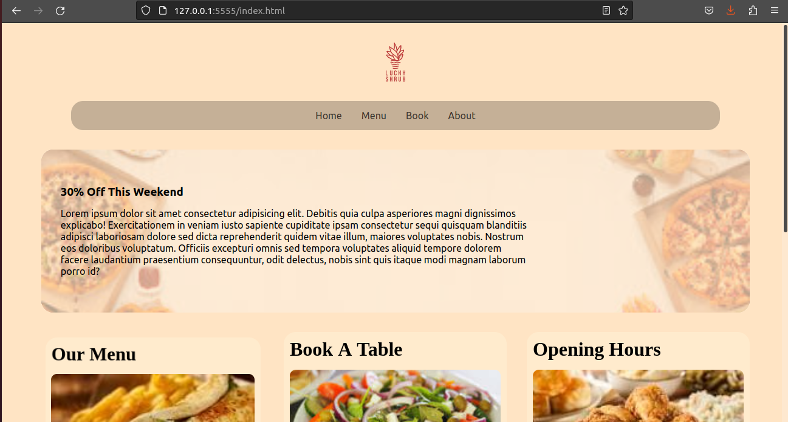

# Meta Capstone - Frontend Project


## Screenshot




### Built with

- Semantic HTML5 markup
- CSS custom properties
- Flexbox
- CSS Grid


### What I learned
- Semantich Html
- Useful Meta Tags for SEO Optimization
- OGP Tags 
- Advance Css Grids
- Advance Css FlexBox
- Css Transition
- Css Animation
- Advance Css Selectors 


```html
<h1>I love html! ❤️</h1>
```
```css
// Css is amazing!

.proud-of-this-css {
  color: papayawhip;
}
```